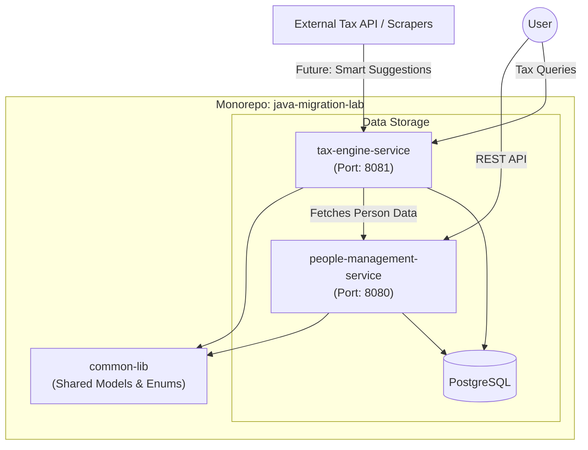

# Architectural Blueprint: People & Tax Ecosystem

## Vision
To build a modern, high-performance Java 21 monorepo that manages the lifecycle of various economic personas and provides a specialized, intelligent Tax Engine for calculating and optimizing Indian Income Tax.

---

## 1. High-Level Architecture

---

## 2. Component Breakdown

### A. People Management Service
*   **Purpose**: The system of record for individuals.
*   **Domain Model**: Uses Java 21 **Sealed Hierarchies** to define personas:
    *   `Person` (Sealed Interface)
        *   `Employee` (Full-time & Contractors)
        *   `SelfEmployed` (Freelancers, Doctors, Consultants)
        *   `BusinessOwner` (LLCs, LLPs, Sole Proprietorships)
*   **Tech Stack**: Spring Boot 3.2+, Virtual Threads, JPA.

### B. Tax Engine Service
*   **Purpose**: Specialized logic for Indian Taxation (Old vs New Regime).
*   **Key Features**:
    1.  **Tax Calculation**: Pattern matching over the `Person` hierarchy to apply specific sections (Sec 192 for Employees, 44AD/44ADA for Business/Professionals).
    2.  **Deduction Engine**: Handles 80C, 80D, HRA, and Standard Deductions.
    3.  **Smart Predictions**: Suggestions for tax-saving investments based on income slabs.
*   **Future**: ML-based suggestions to maximize net take-home pay by analyzing external scraping results of latest schemes.

### C. Common Library
*   **Purpose**: Shared DTOs, Enums (like `TaxRegime`, `EmployeeType`), and utility classes to ensure type safety across services.

---

## 3. Data Flow

1.  **Registration**: A User registers a `Person` via `people-management-service`.
2.  **Assessment**: The user requests a tax computation from `tax-engine-service`.
3.  **Data Fetching**: `tax-engine-service` calls `people-management-service` (via OpenFeign or WebClient) to get the latest income and profile details.
4.  **Computation**: The Tax Engine applies Java 21 `switch` expressions to determine the tax liability based on the latest Indian Budget slabs.
5.  **Output**: Returns a detailed breakdown of Tax, Cess, Surcharge, and Savings Tips.

---

## 4. Java 21 Showcase Features
*   **Pattern Matching for Switch**: For complex multi-slab tax logic.
*   **Record Patterns**: To deconstruct income components instantly.
*   **Structured Concurrency**: To fetch person data and external investment rates in parallel.
*   **Virtual Threads**: To handle massive loads during tax filing seasons.

---

## 5. Roadmap
- [x] **Phase 1**: Restructure into Maven Multi-Module Monorepo.
- [x] **Phase 2**: Implement `Person` hierarchy in `people-management-service`.
- [x] **Phase 3**: Create `tax-engine-service` with basic Indian Tax Slabs (New Regime).
- [ ] **Phase 4**: Add Deduction/Exemption modules (80C, HRA).
- [ ] **Phase 5**: Intelligence layer - Scraping & Savings Suggestions.
